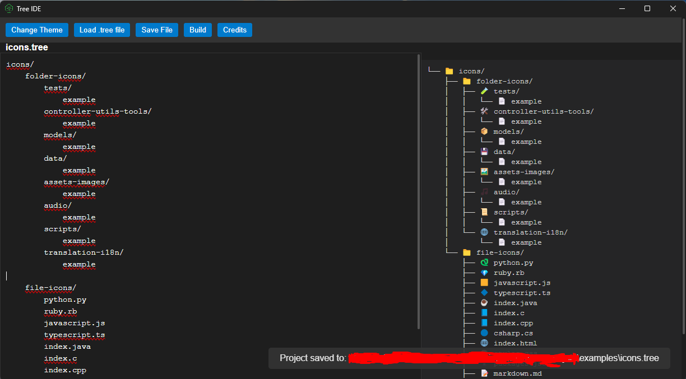

# Tree IDE

**Tree IDE** is a lightweight, open-source project structure editor designed for developers who want to quickly design, visualize, and build directory trees from a simple text-based editor.

It combines a plain-text editor with a real-time tree view and one-click project generation.

- Website: [https://tree.immare.xyz/](https://tree.immare.xyz/)
- Repository: [https://github.com/TreeIDE/TreeIDE](https://github.com/TreeIDE/TreeIDE)

## Features

- **Text-based structure editor**: Write your folder and file structure in plain text.
- **Real-time tree view**: See your structure rendered as a tree while you type.
- **File and folder icons**: Popular file extensions and folder names are automatically displayed with icons.
- **Indentation control**: Use <kbd>Tab</kbd> and <kbd>Shift</kbd> + <kbd>Tab</kbd> to increase or decrease indentation.
- **Keyboard shortcuts**:
  - <kbd>Ctrl</kbd> + <kbd>S</kbd>: Save
  - <kbd>Ctrl</kbd> + <kbd>Shift</kbd> + <kbd>S</kbd>: Save As
- **Theme switcher**: Toggle between light and dark theme.
- **Toast notifications**: Feedback for save and build actions.
- **Build mode**: Automatically create the directory structure on your machine.
- **Credits modal**: Built-in credits screen with project information and license.

## Installation

1. Clone the repository:

   ```bash
   git clone https://github.com/TreeIDE/TreeIDE.git
   cd TreeIDE
   ```

2. Install dependencies:

   ```bash
   npm install
   ```

3. Run in development mode:

   ```bash
   npm start
   ```

## Usage

1. Launch Tree IDE.
2. Use the text editor on the left to write your structure.

   ```text
   src/
       index.js
       styles.css
   assets/
       images/
       audio/
   README.md
   ```

3. The tree view on the right updates automatically.
4. Click **Build** to generate the folders and files.
5. Save and load `.tree` project files with the toolbar.

You can check the [`examples`](../examples) folder and load the `.tree` files in the IDE.

## Keyboard Shortcuts

- <kbd>Tab</kbd>: Indent line / increase nesting level.
- <kbd>Shift</kbd> + <kbd>Tab</kbd>: Unindent line / decrease nesting level.
- <kbd>Ctrl</kbd> + <kbd>S</kbd>: Save current file.
- <kbd>Ctrl</kbd> + <kbd>Shift</kbd> + <kbd>S</kbd>: Save As.

## Icons

If you cannot see icons or emojis correctly in Tree IDE, you may need to install an emoji-compatible font.

We recommend installing **Twemoji Color Font** on your system.

## Project Structure

```text
tree-ide/
|-- assets/           # App icons and screenshots
|-- docs/             # Documentation, authors, and license
|-- examples/         # .tree example files
|-- index.html        # Main window UI
|-- main.js           # Electron main process
|-- package.json      # Project metadata and scripts
|-- package-lock.json # Dependency lockfile
|-- preload.js        # Exposes safe APIs to renderer
|-- renderer.js       # UI logic and tree rendering
|-- styles.css        # Theme and layout
|-- treeCreator.js    # Directory and file generation
`-- treeParser.js     # .tree parsing logic
```

## Credits

- Project creator: [Mare](https://github.com/git-mare).

## License

This project is licensed under the MIT License. See [`LICENSE`](https://github.com/TreeIDE/TreeIDE/blob/main/docs/LICENSE) for the full license text.

## Screenshot


